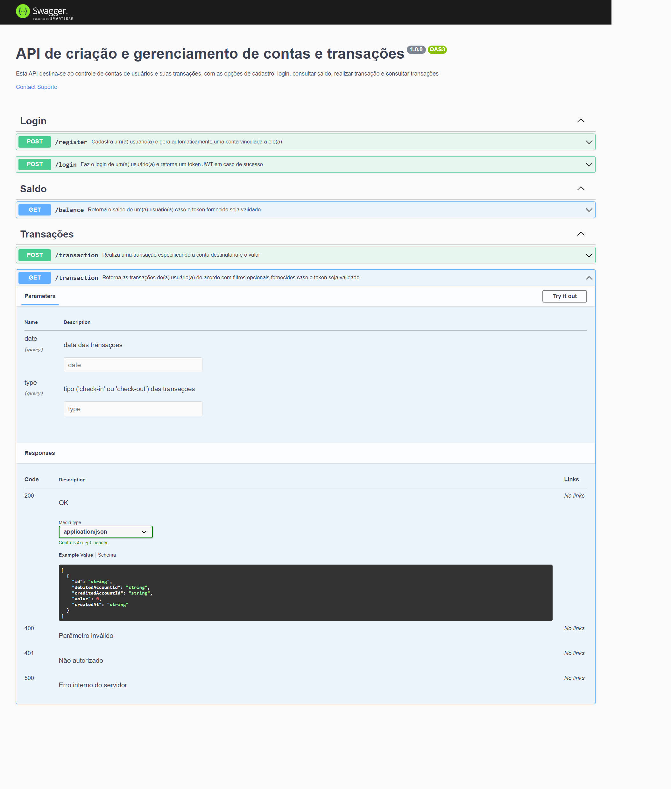

## API com Node, Typescript, Express, PostgreSQL e PrismaORM aplicando TDD, Clean Archtecture e SOLID principles para cadastro e gerenciamento de contas e transações

### Screenshot

### Construído com

-   Node
-   Typescript
-   Express
-   PostgreSQL

API desenvolvida com Node, Express e Typescript.

Por meio da API, são disponibilizados recursos para as operações de registro de novo(a) usuário(a) com criação de conta, login com autenticação via JsonWebToken - JWT, obtenção de saldo, realização de transações e obtenção da listagem de transações efetuadas.

Foi realizada a documentação via Swagger, conforme a imagem acima, que pode ser acessada pelo endpoint "/api-docs".

Por meio do endpoint "/register", utilizando-se o método HTTP POST, o usuário deve encaminhar no corpo da requisição obrigatoriamente os campos "username", "password" e "passwordConfirmation".

Caso algum dos parâmetros acima não seja fornecido, é retornada uma resposta 400 BAD REQUEST (MissingParamError).

Além disso, é preciso que o usuário forneça um "username" que não esteja em uso e que seja composto por no mínimo 3 caracteres.

Quanto ao "password", é preciso que tenha ao menos 8 caracteres, sendo um número e uma letra maiúscula.

O campo "passwordConfirmation" deve ser o mesmo do campo "password". Se alguma dessas exigências não for observada, é retornada uma resposta 400 BAD REQUEST (InvalidParamError).

Internamente, a API gera uma conta vinculada ao usuário em caso de sucesso em sua criação, retornando uma resposta 201 CREATED.

Com o endpoint "/login", utilizando-se o método HTTP POST, o usuário deve fornecer no corpo da requisição obrigatoriamente os campos "username" e "password".

Caso os dados estejam corretos, é retornada uma resposta 200 OK, com o "accessToken" gerado via JsonWebToken - JWT, com validade de 24 horas.

Para consumo das rotas seguintes é preciso inserir o accessToken no header da requisição, em "Authorization: Bearer accessToken".

Dessa forma, um(a) usuário(a) poderá visualizar o saldo de sua conta (balance) apenas se incluir o accessToken no header da requisição, caso em que receberá uma resposta 200 OK com o campo "balance" e a indicação do saldo atual.

Com o endpoint "/transaction", pelo método HTTP POST, o(a) usuário(a) também pode realizar uma transferência de sua conta para uma conta de terceiro, sendo para isso necessário que forneça no corpo da requisição o username da conta recebedora ("creditedUsername") e o valor ("value"), além de estar autenticado com o respectivo accessToken fornecido no header da requisição.

Em caso de êxito, o(a) usuário(a) receberá uma resposta 200 OK, com a indicação do ID da transação, a conta pagadora ("debitedAccountId"), a conta recebedora ("creditedAccountId"), o valor e a data da operação ("createdAt").

Neste caso são feitas transações em bloco a fim de garantir que somente se concretizem se todas forem frutíferas, sendo a primeira a criação de um registro na tabela Transactions, a segunda a atualização do saldo da conta pagadora, com a subtração do valor da transação, e a terceira a atualização do saldo da conta recebedora, com a adição deste valor.

Por meio do método "$transaction" do PrismaORM, se garante que, caso uma dessas transações falhe, todas sejam revertidas, garantindo-se a atomicidade da transação e evitando inconsistências.

Por último, há o método HTTP GET, neste mesmo endpoint "/transaction", por onde é possível ao(a) usuário(a), se devidamente autenticado com o accessToken fornecido no header da requisição, obter todas as transações em que estiver envolvida sua conta, seja como pagador ou recebedor.

Em caso de sucesso, é enviada uma resposta 200 OK com um array de transações, sendo que cada uma consiste em um objeto com ID da transação, ID da conta pagadora ("debitedAccountId"), ID da conta recebedora ("creditedAccountId"), valor ("value") e data de operação ("createdAt").

Neste endpoint, é possível ao(a) usuário fornecer query params na URL a fim de possibilitar a filtragem da busca.

É possível fornecer o parâmetro "?date=yyyy-MM-dd" para que sejam retornadas somente as transações realizadas ou recebidas por ele(ela) na data especificada.

Também é possível indicar o parâmetro "?type", que pode ser "cash-in" ou "cash-out", retornando apenas as transações em que o usuário figurar como, respectivamente, recebedor ou pagador.

Os dois parâmetros acima podem ou não ser utilizados em conjunto, sendo sua utilização opcional.

### Aplicação do TDD (Test-Driven-Development)

Para construção da API foi aplicado o TDD, realizando testes unitários para garantir as funcionalidades dos componentes do sistema, sendo que os arquivos de testes foram alocados próximos aos arquivos de suas implementações.

É possível executar o comando "npm run test:ci" para executar todos os testes e ao final verificar o percentual de cobertura de testes da aplicação inteira.

### Aplicação da Clean Archtecture

Para estruturação das camadas da API, foram aplicados os princípios da Clean Archtecture desenvolvida por Robert Martin a fim de segregar os componentes em camadas com o intuito de reduzir o acoplamento entre elas.

Na camada mais interna, há o diretório "domain", onde está a modelagem das entidades de Usuário ("UserModel"), Conta ("AccountModel") e Transação ("TransactionModel").

No mesmo diretório "domain", na subpasta "useCases", há a definição das interfaces dos casos de uso, responsáveis por realizar operações com as entidades na camada de domínio, orquestrando a interação entre elas.

Na camada acima, dentro da pasta "application", em "usecases", há a implementação das interfaces dos casos de uso, divididas em subpastas para cada caso de uso estipulado na camada de domínio, sendo uma para criação de um usuário, outra para autenticação do usuário, outra para obtenção do saldo, outra para criação de uma transação e outra para visualização das transações.

Ainda em "application", há a pasta "protocols", onde estão definidas as interfaces dos repositórios, ou seja, das classes responsáveis pela persistência e manipulação do banco de dados, e também dos serviços de hash e criptografia.

Após a camada de casos de uso, há a camada de "presentation", onde se situam os "controllers", que intermediam as requisições e respostas vindas e encaminhadas ao exterior da aplicação, delegando as operações e retornando uma resposta ao(a) usuário(a).

Nesta camada, há a pasta "presentation", e a subpasta "controllers", onde constam os controladores responsáveis por validar os campos obrigatórios da requisição, caso houver, delegar as atividades aos respectivos casos de uso, e formatar a resposta para o usuário em caso de sucesso ou de falha, além de tratar erros.

Mais externamente, há a camada de "infra", referente à infraestrutura, onde se situam os componentes de mais "baixo-nível" da aplicação.

É nesta camada ("/infra/database/postgres") onde foi implementado o banco de dados PostgreSQL para implementação das interfaces dos repositórios, com o suporte do ORM Prisma.

Por último, há a camada principal ("main"), onde está configurada a aplicação e são instanciadas e injetadas as dependências das implementações das outras camadas.

Há também a implementação de "adapters" para adaptar requisições e respostas do formato do framework "Express" para um formato menos específico, que será encaminhado para as camadas mais internas da aplicação, evidenciando que o framework utilizado não é conhecido pelas camadas de mais "alto-nível".

Nesta camada, é configurada a classe de inicialização da aplicação, utilizando o framework "Express", localizada em "/main/config/app.ts", sendo as rotas definidas na pasta "routes".

### Aplicação dos SOLID principles

Os SOLID principles consistem em práticas consolidadas no âmbito da programação orientada a objetos visando a construção de aplicações com menor acoplamento e maior coesão.

No caso desta aplicação, foram aplicados em maior grau os princípios Single Responsability, Liskov Substitution, Dependency Inversion e Interface Segregation.

O princípio Single Responsability defende que cada classe possua apenas uma razão para ser modificada, ou seja, que possua uma única responsabilidade, e foi com base nisso que se optou por dividir cada funcionalidade da aplicação em um caso de uso distinto.

No caso da persistência ou obtenção de dados, essa responsabilidade ficou apenas com os repositórios, de modo que quando necessário os casos de uso apenas chamarão a implementação dos repositórios, que cuidarão da persistência e acesso ao banco de dados.

Dessa forma se reduz o acoplamento e facilita a manutenibilidade do sistema.

Quanto aos princípios Liskov Substitution e Dependency Inversion, ambos buscam alcançar um menor acoplamento entre componentes da aplicação, isso porque o primeiro defende que seja possível trocar implementações de mais baixo-nível sem que isso comprometa a funcionalidade mais alto-nível, enquanto que o segundo recomenda que os componentes de mais alto-nível dependam apenas da abstração de componentes de baixo-nível, e não de suas implementações.

No caso, as classes dos controllers e useCases possuem dependências, que são injetadas por seus construtores, sempre como interfaces.

Dessa forma, é possível alterar a implementação destas interfaces no momento de injetar a dependência sem que isso comprometa a funcionalidade dos componentes de mais alto-nível, já que todas as implementações obrigatoriamente seguirão a definição da interface, reduzindo acoplamento. 

Por conta da divisão em camadas seguindo os princípios da Clean Architecture, as camadas de mais alto-nível não conhecem e nem dependem das implementações das camadas mais externas.

Quanto ao princípio da Interface Segregation, optou-se por particionar as funcionalidades dos repositórios em interfaces individualizadas a fim de facilitar sua testabilidade na realização de testes unitários, além de uma maior flexibilidade no momento de implementar e injetar as implementações como dependências.

## Execução

<!-- Para executar a aplicação localmente, é preciso primeiro iniciar o container docker com a instância do MariaDB, onde são persistidos os dados.

Para isso é preciso, com o docker em funcionamento, executar no terminal o comando "docker run --name calculator-mariadb -p 3306:3306 --env MARIADB_USER=root --env MARIADB_PASSWORD=password --env MARIADB_ROOT_PASSWORD=password --env MARIADB_DATABASE=calculator-mariadb -d mariadb:latest".

Depois, será necessário executar "docker start calculator-mariadb" no terminal para iniciar o container. -->

Após, é preciso executar "npm install" para instalar todas as dependências da aplicação.

Para executar a aplicação em modo de produção, é preciso executar "npm run build" para executar a transpilação do projeto de Typescript para Javascript, e então executar "npm start".

## Autor

-   GitHub - Vinícius dos Santos Verissimo (https://github.com/viniciusdsv93)

docker: docker run --name account-management -p 5432:5432 -e POSTGRES_DB=account_management_db -e POSTGRES_USER=admin -e POSTGRES_PASSWORD=password -d postgres:10-alpine